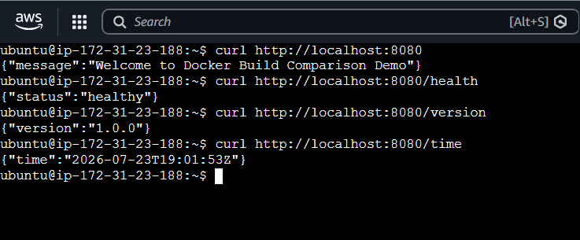
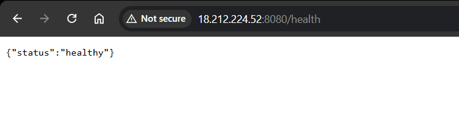
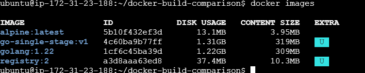
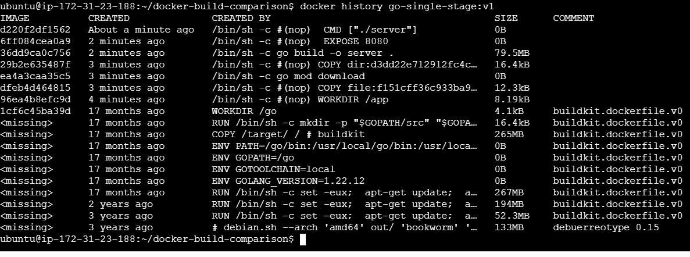
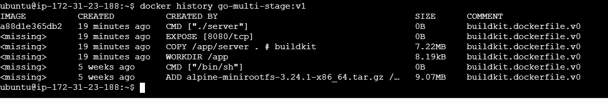

# 🚀 Reducing Docker Image Size Using Multi-Stage Docker Builds

> **Project Outcome:** Reduced the Docker image size from **1.31 GB** to **24.3 MB** by implementing Docker Multi-Stage Builds, achieving approximately **98.2% image size reduction** while preserving the same application functionality.

---

# 📖 Overview

Container image size directly impacts deployment speed, storage consumption, network bandwidth utilization, and the overall security of containerized applications.

Traditional Docker builds often package everything required during development—including compilers, build dependencies, source code, and caches—into the final image. While functional, these images are unnecessarily large and inefficient for production deployments.

This project demonstrates how **Docker Multi-Stage Builds** create lightweight, production-ready images by separating the build environment from the runtime environment.

Using the **same Go REST API**, this project compares:

- Traditional Single-Stage Docker Build
- Optimized Multi-Stage Docker Build

and measures the improvement achieved through image optimization.

---

# 🎯 Objectives

- Build the same Go REST API using two Docker build strategies.
- Compare image size and image layers.
- Demonstrate Docker image optimization techniques.
- Understand how Multi-Stage Builds improve production deployments.
- Follow Docker containerization best practices.

---

# ❗ Problem Statement

A traditional Docker build packages everything into a single image, including:

- Go compiler
- Go modules
- Source code
- Build cache
- Runtime binary

Although the application works correctly, the resulting image contains many components that are unnecessary in production.

This leads to:

- Larger container images
- Slower deployments
- Increased storage usage
- Higher bandwidth consumption
- Larger attack surface

---

# ✅ Solution

Docker Multi-Stage Builds separate the application build process from the runtime environment.

Instead of deploying the complete development environment, only the compiled Go application is copied into the final image.

This significantly reduces the size of the production image while maintaining identical functionality.

---

# 🏗️ Project Architecture

```
                  Go REST API
                       │
          ┌────────────┴────────────┐
          │                         │
          ▼                         ▼
 Single-Stage Build          Multi-Stage Build
          │                         │
          ▼                         ▼
  Go SDK + Source Code      Alpine + Go Binary
          │                         │
          ▼                         ▼
  Large Runtime Image       Optimized Runtime Image
          │                         │
          └────────────┬────────────┘
                       ▼
              Performance Comparison
```

---

# 📂 Project Structure

```text
docker-build-comparison/
│
├── app/
│   ├── go.mod
│   ├── main.go
│   └── handlers.go
│
├── single-stage/
│   └── Dockerfile
│
├── multi-stage/
│   └── Dockerfile
│
├── project-screenshots/
│   ├── go-rest-api-cli-output.png
│   ├── web-api-output.png
│   ├── single-stage-image-size.png
│   ├── single-stage-layers-list.png
│   ├── multi-stage-image-size.png
│   └── multi-stage-layers-list.png
│
└── README.md
```

---

# ⚙️ Technologies Used

- Go
- Docker
- Multi-Stage Docker Builds
- Alpine Linux
- Docker CLI

---

# 🌐 REST API

| Method | Endpoint | Description |
|---------|----------|-------------|
| GET | / | Welcome Message |
| GET | /health | Health Check |
| GET | /version | Application Version |
| GET | /time | Current Server Time |

---

# 🚀 Build Instructions

## Build Single-Stage Image

```bash
docker build \
-f single-stage/Dockerfile \
-t go-single-stage:v1 .
```

Run the container

```bash
docker run -d \
-p 8080:8080 \
--name go-single-stage \
go-single-stage:v1
```

---

## Build Multi-Stage Image

```bash
docker build \
-f multi-stage/Dockerfile \
-t go-multi-stage:v1 .
```

Run the container

```bash
docker run -d \
-p 8080:8080 \
--name go-multi-stage \
go-multi-stage:v1
```

---

# 🔍 Validation

Verify the images:

```bash
docker images
```

Inspect image layers:

```bash
docker history go-single-stage:v1

docker history go-multi-stage:v1
```

---

# 📸 Project Demonstration

## REST API Output

The Go REST API running successfully from the Docker container.



---

## Browser Output

Application successfully responding through the exposed web endpoint.



---

# 📊 Results

## Docker Image Size

### Single-Stage Build



---

### Multi-Stage Build


---

## Docker Image Layers

### Single-Stage Build



---

### Multi-Stage Build



---

# 📈 Performance Comparison

| Metric | Single-Stage Build | Multi-Stage Build |
|---------|-------------------:|------------------:|
| Docker Image Size | **1.31 GB** | **24.3 MB** |
| Image Size Reduction | - | **≈98.2%** |
| Runtime Base Image | Go SDK | Alpine Linux |
| Go Compiler Included | ✅ Yes | ❌ No |
| Source Code Included | ✅ Yes | ❌ No |
| Build Dependencies Included | ✅ Yes | ❌ No |
| Runtime Binary | Included | Included |
| Deployment Speed | Slower | Faster |
| Storage Requirement | Higher | Lower |
| Attack Surface | Larger | Smaller |
| Production Ready | ❌ | ✅ |

---

# 🎯 Outcome

By implementing Docker Multi-Stage Builds:

- Reduced Docker image size from **1.31 GB** to **24.3 MB**
- Achieved approximately **98.2% image size reduction**
- Eliminated the Go compiler from the production image
- Removed source code from the runtime image
- Removed unnecessary build dependencies
- Reduced storage consumption
- Improved deployment efficiency
- Lowered the container attack surface
- Produced a clean, lightweight production-ready image

---

# 💡 Key Learnings

- Multi-Stage Builds separate the build environment from the runtime environment.
- The final production image should contain only the application and its runtime dependencies.
- Smaller images improve deployment speed and reduce storage costs.
- Removing build tools and source code enhances container security.
- Layer caching improves Docker build efficiency.
- Multi-Stage Builds are considered a Docker best practice for production workloads.

---


# Author

**Manoj Selvan G**
linkedin.com/in/manojselvang/
manojselvang@gmail.com
If you found this project useful, consider giving it a ⭐ on GitHub.
